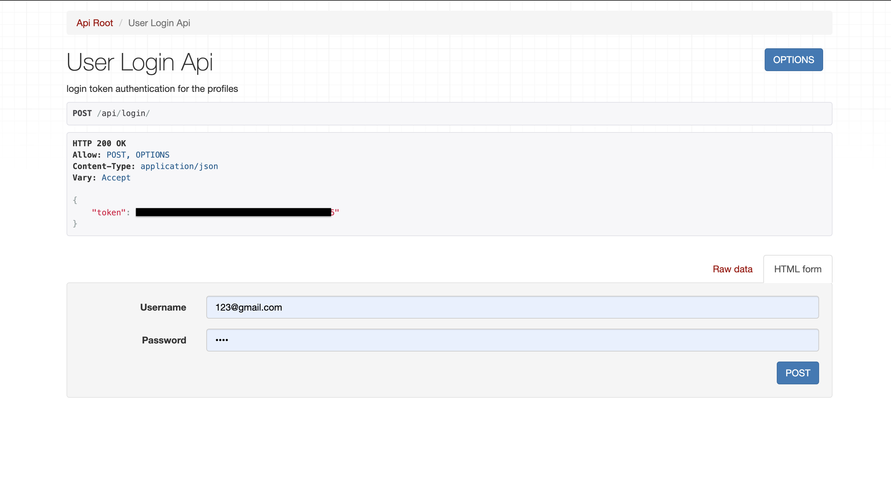

# Your_News

- a profiles django api with authentication and profile feed functions
- each user can choose their prefrence of news type
- anyone can retrieve articles or create articles accordingly
- user feeds/comments for certain articles may be created or retrieved by authorized users, only for those that are authenticated

# API/profiles
#### Users registration, selecting their preference of articles and account information

# API/articles
#### Any user (unauthorized) could create and access articles

# API/feed
#### Only authorized(logged in) users/admins can post comments toward each article, to post under api view use a request header extension and the token generated during login

-------------------------------

-------------------------------

# Technologies
- Django
- Django REST Framework

